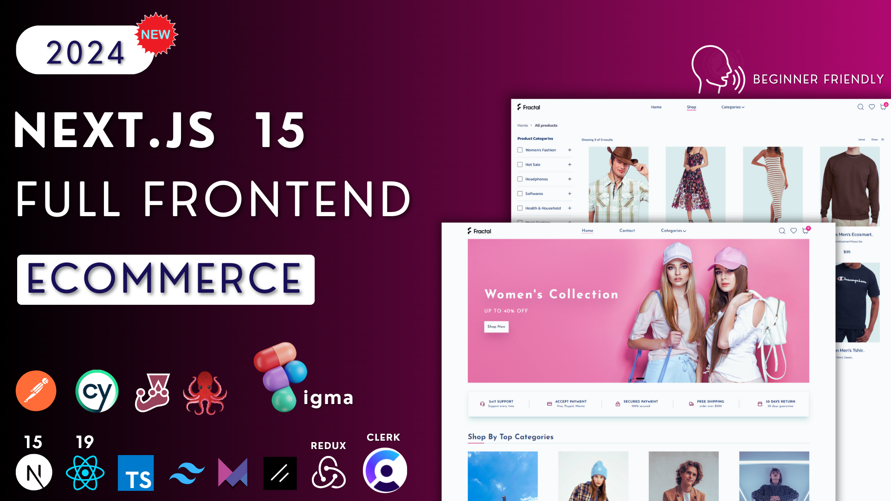
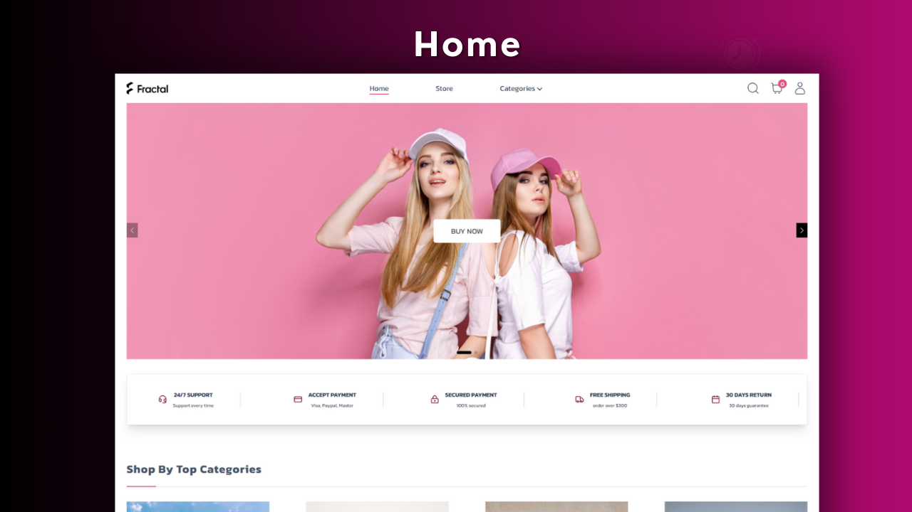
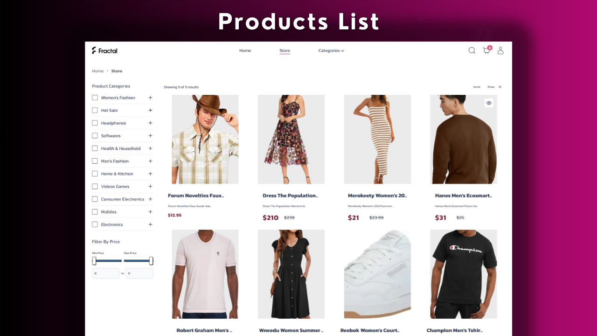
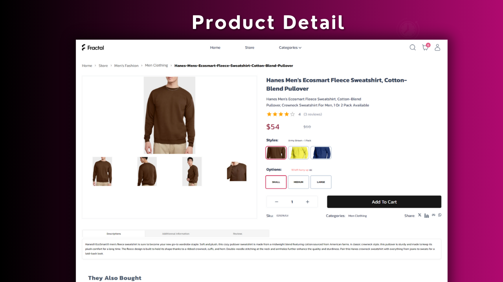
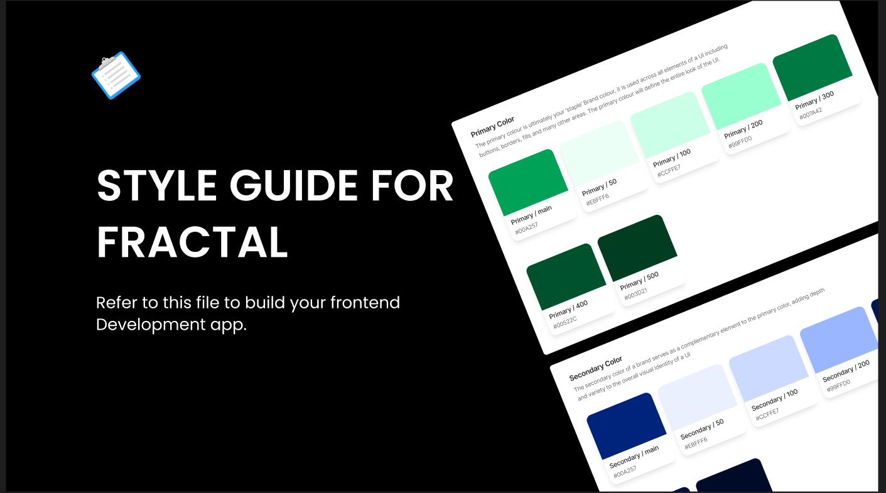

## ✔️ Introduction

You are $${\color{green}new}$$  to $${\color{green}React}$$  and ready to $${\color{yellow} learn }$$ Next Js This course is definitely for you. I made everything $${\color{green}easier}$$  to help you learn step by step all the frontend development with NextJs.

You will start from the basics concepts of Nextjs then you will grow up by learning responsive design with TailwindCss and Nextjs from a Figma Design template and so much more.




# Become a Frontend NextJs Developer - Full Course.

This is how the project looks:

<table>
  <tr>
    <td>
      <a href='./public/assets/images/home.png'></a>
    </td>
    <td>
      <a href='./readme/assets/images/products_list.png'></a>
    </td>
    <td>
      <a href='./public/assets/images/product_detail.png'></a>
    </td>
  </tr>
</table>


## 🎯 What skills you will learn  

Throughout this course, you will improve your technical frontend skill set such as:

- Proficiency in JavaScript (ES6+), React.js, and Next.js framework.

- Knowledge of  React Components, State Management, and Hooks;

- Experience with server-side rendering (SSR), static site generation (SSG), client-side rendering, etc.;

- Experience with RESTful APIs and efficient methods of requesting data from backend servicesetc...;

- Experience with CSS Framework  (Tailwindcss) and the principles of responsive web design;

- Experience with version control systems (Git)

- Experience with testing frameworks (Jest,React testing library, Cypress) and experience with code quality tools;

- Basic knowledge of web performance optimization techniques and the principles of an accessible web.


## ✅ Prerequisite knowledge

This tutorial assumes knowledge of HTML, CSS, JavaScript, and no knowledge of React or NextJs.


## ✅ System requirements

- Before you start this course, make sure you have the following installed:

- Node.js 20.12.0 or later installed.

- Operating systems: macOS, Windows (including WSL), or Linux.

- VSCode or another text editor of your choice.


## 📚 Get the Brand File 

[Pdf File ](https://mega.nz/file/OUFiHKgD#C0_OebdaCO6C_2EP0NYaPyqpVKXnjq8wNBi94p3FVqw)

[Figma File ](https://www.figma.com/design/1PgX87mEwDbaDZbfV6CSIe/Style-Guide-Template-(Color-Styles-%26-Typography)-(FRACTAL)?node-id=0-1&t=hlK4Mf8kf0G5Dl56-0)




## 📅 Code organization and folder structure

The project contains all Next.js App Router pages and layouts, and takes care of the routing.

```
.
├───actions
├───app                 
│   └───(website)
│       ├───(auth)
│       │   ├───sign-in
│       │   │   └───[[...sign-in]]
│       │   └───sign-up
│       │       └───[[...sign-up]]
│       └───(pages)
│           ├───(home)
│           ├───account
│           │   ├───address
│           │   ├───dashboard
│           │   └───orders
│           ├───cart
│           ├───categories
│           │   └───[slug]
│           │       └───products
│           ├───checkout
│           ├───order
│           │   └───[id]
│           └───products
│               └───[slug]
├───components
│   ├───custom
│   ├───modules
│   │   └───website
│   │       ├───account
│   │       ├───cart
│   │       ├───categories
│   │       ├───Chechout
│   │       ├───footer
│   │       ├───header
│   │       ├───home
│   │       ├───order
│   │       ├───Product
│   │       ├───products
│   │       └───review
│   └───ui
├───constants
├───cypress
│   ├───e2e
│   ├───fixtures
│   ├───pages
│   ├───selectors
│   └───support
├───data
├───hooks
├───lib
├───providers
├───public
│   └───assets
│       └───images
├───store
├───types
└───_tests_
    └───ui

```

This structure enables efficient routing and organization of different parts of the app.

### `/actions` **directory**

This folder contains asynchronous functions that are executed on the server. They can be called in Server and Client Components to handle form submissions and data mutations in Next.js applications.

### `/app` **directory**

This folder is the Root directory of the app. it is also known as the app router.
It supports shared layouts, nested routing, loading states, error handling, and more.

```

  (website)    
    ├───(auth)   
    │   │   layout.tsx
    │   │   
    │   │
    │   ├───sign-in
    │   │   └───[[...sign-in]]
    │   │           page.tsx
    │   │
    │   └───sign-up
    │       └───[[...sign-up]]
    │               page.tsx
    │
    └───(pages)
    │   │   layout.tsx
    │   │ 
    │   │
    │   ├───(home)
    │   │       page.tsx
    │   │
    │   ├───account
    │   │   │   layout.tsx
    │   │   │ 
    │   │   │
    │   │   ├───address
    │   │   │       page.tsx
    │   │   │
    │   │   ├───dashboard
    │   │   │       page.tsx
    │   │   │
    │   │   └───orders
    │   │           page.tsx
    │   │
    │   ├───cart
    │   │       page.tsx
    │   │
    │   ├───categories
    │   │   └───[slug]
    │   │       └───products
    │   │               page.tsx
    │   │
    │   ├───checkout
    │   │       page.tsx
    │   │
    │   ├───order
    │   │   └───[id]
    │   │           page.tsx
    │   │
    │   └───products
    │        │   page.tsx
    │        │
    │        └───[slug]
    │                page.tsx

```


### File conventions 

Next.js provides a set of special files to create UI with specific behavior in nested routes such as 
 

### `layout.tsx`

That is shared between multiple routes. On navigation, layouts preserve state, remain interactive, and do not re-render. 
You can define a layout by default exporting a React component from a layout.js file. The component should accept a children prop that will be populated with a child layout (if it exists) or a page during rendering

By default, layouts are nested, which means they wrap child layouts via their children prop. 


### `error.tsx`

In Next js Errors can be divided into two categories: expected errors and unexpected  exceptions:
Expected errors can be handled with try or catch and UseActionState.
But uncaught exceptions is handled by using error.tsx and global-error.tsx files

unexpected errors that indicate bugs or issues that should not occur during the normal flow of your application.

in other words, Next.js uses error boundaries to handle unexpected exceptions. it catches errors and shows a fallback UI instead of the component tree that crashed.


### `globals.css`

This is the main css file of the application. You can use this file to add CSS rules to all the routes in your application - such as CSS reset rules, site-wide styles for HTML elements like links, and more.


### `fonts.tsx`

it allows you to create custom fonts with next/font.
Next.js automatically optimizes fonts in the application when you use the next/font module. It downloads font files at build time there are no additional network requests for fonts which would increase performance.


### `loading.tsx`

The loading file is a special file that can be nested.
it allows you to create fallback UI to show as a replacement while page content loads.


### Metadat files: `manifest.ts`, `robots.ts`, `sitemap.ts`

Next has some special files like manifest, robot , sitemap .
Each file convention can be defined using a static file (e.g. manifest.xml), or a dynamic variant that uses code to generate the file for example manifest.ts 


### `(Website)` **directory**

In the app directory, nested folders are normally mapped to URL paths. However, you can mark a folder as a Route Group to prevent the folder from being included in the route's URL path.

This allows you to organize your route segments and project files into logical groups without affecting the URL path structure.
A route group can be created by wrapping a folder's name in parenthesis like this: (folderName)

This folder contains all the routes and javascript files needed to build frontend app.

We have:


### `(auth)` **directory**:

This group route is used to organize clerk authentification routes like sign-in and sign-up


### `(pages)` **directory**:

This group is used to organize all frontend routes


###  `components` **directory**

this folder contains three folders custom, modules and ui

1. Custom **directory** 

this folder contains react components  which are independent and reusable.

2. Module  **directory**

This folders contains wrapper components:
A wrapper components are components that surround unknown components and provide a default structure to display the child components.


3. ui  **directory**

This folders contains react components  which are  independent and reusable created by a third party like shadcn UI 

###  `constants`  **directory**

We use this folder to create static constantes 


###  `_tests_`  **directory**

This is the directory that Jest will use to look up tests.


### `cypress`  **directory**

This is the root directory where Cypress-related files and folders are stored.

```
├───e2e
├───fixtures
├───pages
├───selectors
└───support

```

1. e2e  **directory**

This directory is where you should place your test files. Cypress will automatically detect and run tests from this folder. Test files typically have .spec.ts or .test.ts file extension.

2. fixtures **directory**

You can use this directory to store static data or fixture files that your tests might need, such as JSON, CSV, or text files.

3. pages  **directory**

You can use this directory to create object page models.
The Page Object Model (POM) is a design pattern commonly used in software testing, specifically in the context of test automation for web applications. It helps in creating an organized and maintainable structure for test scripts by encapsulating the details of the web pages and their elements.


3. selectors  **directory**

You can use this directory to group all selector for every pages for testing.
each file contains all selectors needed to perform test for a specific page


###  `hooks`  **directory**

this folders contains all custom hooks which will be used on client components


###  `lib` **directory**

this folder contains all the utility functions. 


###  `providers` **directory**

This folder is kind of root folder for third party library. it is used to wrap all those libraries which is needed throughout the app


###  `public` **directory**

This folder serve static assets, like images, fonts files. 


###  `store` **directory**

This folder contains state management files for redux toolkit.


###  `types` **directory**

all types we are going to create should be stored in that folder


###  `ènv files`

Next.js comes with built-in support for environment variables, which allows you to create multiple environments variables :

Next.js allows you to set defaults in .env (all environments), .env.development (development environment), and .env.production (production environment) .env.testing (production environment).

1.  `gitignore`
2.  `babel.config`
3.  `cypress.config`
4.  `eslint.config`

5.  `jest files`

*jest.config.ts* is the default jest config file : it defines Jest configurations.

on the other hand *jest.setup.ts* configuration which are supposed to run before every test case.

1.  `middleware`
2.  `next.config`
3.  `package-lock`
4.  `postcss`
5.  `README`
6.  `tailwind`
7.  `tsconfig`

## Quick start

To spin up this example loccaly, follow these steps

### Clone

Use the ` git clone ` CLI to clone template directly  to your machine


### Run project on local

```bash
    npm install
```

## Project Dev Steps

1. Environment Setup
   
   Create a env file on the root of project
   PUT THIS INSIDE

```bash

    NEXT_PUBLIC_SERVER_URL=http://localhost:3000
    NEXT_PUBLIC_API_URL=https://fractal-api-zeta.vercel.app

    # Clerk integration 
    NEXT_PUBLIC_CLERK_PUBLISHABLE_KEY=
    CLERK_SECRET_KEY=

    # Stripe integration 
    NEXT_PUBLIC_STRIPE_CLIENT_KEY=
    STRIPE_SECRET_KEY=
    
```

2.  Project Folders & Files Structure

3.  Setup Eslint & typscript
   
4.  Setup Jest

```bash

    # create jest config file 
    npm init jest@latest

    npm install --save-dev jest jest-environment-jsdom @testing-library/dom @testing-library/jest-dom 
    npm install --save-dev @testing-library/react@latest --legacy-peer-deps

     #Add to script in package json
    "test": "jest",
    "test:watch": "jest --watch"  

    #add this to jest.config
    import nextJest from "next/jest.js";
   
    # // Provide the path to your Next.js app to load next.config.js and .env files in your test environment
    const createJestConfig = nextJest({
     dir: './',
    })


    # // createJestConfig is exported this way to ensure that next/jest can load the Next.js config which is async
    export default createJestConfig(config)


# or

```

5. Setup Cypress

```bash
    #install
    npm install cypress --save-dev
    
    #add to pakage json
    "start:test": "cross-env NODE_ENV=test && next build && next start",
    "cypress:open": "cross-env NODE_ENV=test cypress open",
    "cypress:start": "start-server-and-test 'npm run start:test' 3000 'npm run cypress:open'  "

    #lauch 
    npm run cypress:open

    #Some files will be created;
    #add base url localhost to cypress.config
    baseUrl: "http://localhost:3000",

```
    
6. Setup ShadCn and Some Libraries

```bash
    #install
    npx shadcn-ui@latest init
    npm i framer-motion react-hot-toast react-icons


```

7. Setup Frontend UI Kit ( Colors - Fonts - Container )

  - Setup Container screens

  ```bash

    screens: {
        xs: "360px",
        # => @media (min-width: 360px) { ... }

        sm: "575px",
        # => @media (min-width: 575px) { ... }

        md: "768px",
        # => @media (min-width: 768px) { ... }

        lg: "1024px",
        # => @media (min-width: 1024px) { ... }

        xl: "1280px",
        # => @media (min-width: 1280px) { ... }

        "2xl": "1440px",
        # => @media (min-width: 1536px) { ... }

        "3xl": "1680px",
        # => @media (min-width: 1536px) { ... }

        "4xl": "1920px",
        # => @media (min-width: 1536px) { ... }
      },

  ```

  - Setup layout for pages 
  
  ```bash

  import React from "react";
  import Container from "@/components/custom/Container";

  export default function layout() {
    return (
      <div className="border border-black">
        <Container>set up responsive layout</Container>
      </div>
    );
  }
  
  ```
  
   - Setup padding for screens 
  
  ```bash

  import React from "react";
  import Container from "@/components/custom/Container";

  export default function layout() {
    return (
      <div className="border border-black">
        <Container>set up responsive layout</Container>
      </div>
    );
  }
  
  ```
  
  
  - Setup colors 
  
  ```bash

      #inspirations website
      https://tailwindcss.com/docs/customizing-colors

      https://coolors.co

      https://uicolors.app/create
  
  ```

8. Create  Home UI

  - Header component
  
  ```bash
  
  ```

9. Create  Product page UI

10. Create  Product Detail  UI

11. Create  Cart UI

12. Create  Checkout UI

13. Create  Payment UI

14. Create  Dashoard UI

15. Fixing bug 

16. Test Jest 

17. Test Cypress 

28. Deploy 


## How to join me

- Patreon chat: [Patreon](https://www.patreon.com/sylvaincodes)
- Youtube comment: [Youtube](https://www.youtube.com/@sylvaincodes593)

